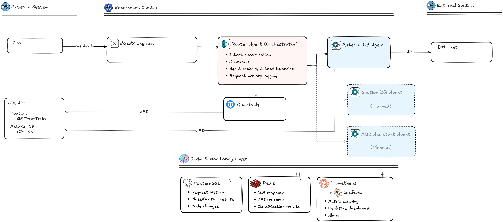

# Jira-Driven Multi-Agent Automation System

> An LLM-based Multi-Agent system that automatically analyzes/modifies C++ source code and creates Bitbucket Pull Requests, triggered by Jira issues



---

## What I Built

This project is a system designed and developed to automate the Material Database addition workflow for **structural analysis software in construction engineering**.

Previously, when a Jira issue was created, developers had to manually open 4 C++ source files, make modifications across dozens of locations, manually create branches, and submit PRs — a repetitive and error-prone process. This system **automates the entire pipeline from Jira Webhook reception to code modification and PR creation**.

### Key Design Decisions

| Problem | Solution |
|---------|----------|
| Cannot pass 17,000+ line C++ files to LLM | Extract only relevant functions via Clang AST, reducing tokens by 50~80% |
| C++ files in EUC-KR encoding get corrupted during LLM modification | Built Binary I/O + encoding detection/restoration pipeline |
| Repeated LLM calls for the same issue increase costs | Multi-layer Redis caching (classification 24h, API 5min) |
| Adding new agents requires extensive system changes | MoE (Mixture of Experts) pattern for independent agent deployment/scaling |
| Misrouting to wrong agent on classification failure | Confidence threshold (0.5) + Graceful Degradation |

---

## Tech Stack

### Backend
| Component | Technology | Purpose |
|-----------|-----------|---------|
| Router Agent | **Python 3.12** / FastAPI 0.109 + Uvicorn (ASGI) | Webhook reception, Intent Classification, Agent routing |
| SDB Agent | **Python 3.12** / Flask 3.0 (Docker Container, K8s Deployment) | C++ code modification, Bitbucket PR creation |
| LLM | **OpenAI GPT-5** | Issue classification, Spec conversion, Code Diff generation |
| C++ Parser | **libclang** 16.0 (Clang AST) | Function-level code extraction, Line number mapping |
| Embedding | **sentence-transformers** (all-MiniLM-L6-v2) | Similar function search (cosine similarity) |

### Data & Caching
| Component | Technology | Purpose |
|-----------|-----------|---------|
| Cache | **Redis** 7.2 | LLM response caching (24h), API response caching (5min) |
| Database | **PostgreSQL** 15 | Request history, Classification results, Code change history, Performance metrics |

### Infrastructure
| Component | Technology | Purpose |
|-----------|-----------|---------|
| Container | **Docker** (Multi-stage, Python 3.12-slim) | Application containerization |
| Orchestration | **Kubernetes** + **Helm** 3.x | Deployment, Scaling, Service discovery |
| Auto-scaling | **HPA** (Horizontal Pod Autoscaler) | CPU/Memory-based auto-scaling |
| Monitoring | **Prometheus** + **Grafana** | Metrics collection and real-time dashboards |
| Ingress | **NGINX Ingress Controller** | External traffic routing, TLS termination |

### External Services
| Service | Integration |
|---------|------------|
| **Jira** | Receives issue creation/update events via Webhook |
| **Bitbucket** | File retrieval, Branch creation, Commits, PR creation via REST API |
| **OpenAI** | GPT-5 Chat Completion API (JSON response mode) |

---

## System Architecture

### End-to-End Processing Flow

```
Jira Issue Created
    |
    | Webhook (POST /webhook)
    v
 ┌─────────────────────────────────────────┐
 │          Router Agent (FastAPI)          │
 │                                         │
 │  1. Parse Webhook payload               │
 │  2. Save request history (PostgreSQL)   │
 │  3. Intent Classification (GPT-5)       │
 │     - Check Redis cache (24h TTL)       │
 │     - Cache Miss → LLM call            │
 │  4. Confidence validation (threshold:0.5)│
 │  5. Agent health check (cache 30s/10s)  │
 │  6. Route to appropriate Agent          │
 └────────────────┬────────────────────────┘
                  |
                  | POST /process
                  v
 ┌─────────────────────────────────────────┐
 │           SDB Agent (Flask)             │
 │                                         │
 │  1. Jira ADF → Material Spec conversion│
 │  2. Create Bitbucket branch             │
 │  3. Process 4 target C++ files:         │
 │     a. Retrieve file as binary          │
 │     b. Detect encoding (chardet+heuristic)│
 │     c. Extract relevant functions via   │
 │        Clang AST                        │
 │     d. Load implementation guide        │
 │     e. Send Focused Prompt to LLM      │
 │     f. Parse and apply JSON Diff        │
 │     g. Re-encode to original encoding   │
 │  4. Multi-file atomic commit            │
 │  5. Create Pull Request                 │
 └─────────────────────────────────────────┘
                  |
                  v
 Bitbucket PR Created → Jira Issue Resolved
```

### Target C++ Files

| File | Role | Processing Method |
|------|------|-------------------|
| `DBCodeDef.h` | Material code constant definitions (#define macros) | Pragma Region parsing, Macro insertion |
| `MatlDB.cpp` | Material Enum and list registration | Clang AST function extraction, Diff generation |
| `DBLib.cpp` | Material default DB configuration | Clang AST function extraction, Diff generation |
| `DgnDataCtrl.cpp` | Yield strength calculation logic | Clang AST function extraction, Diff generation |

---

## Key Technical Details

### 1. Clang AST-Based Code Extraction

Passing 17,000+ line C++ files to the LLM would exceed token limits. Using Clang AST, the system **extracts only the functions relevant to the issue**.

```
Full File (17,000 lines)
    │
    ├── Clang AST Parsing (C++17, Windows macro support)
    │   ├── FUNCTION_DECL node traversal
    │   ├── CXX_METHOD node traversal
    │   └── Content-based line number mapping
    │
    ├── Relevant function filtering (keyword matching)
    │
    └── Focused Context generation (~500 lines)
        ├── Function signature + body
        ├── 3-line upper context
        └── 6-digit line number prefix (e.g., "   420|")
```

Falls back to regex-based function extraction when Clang is not installed

### 2. Encoding Preservation Pipeline

Preserves EUC-KR/CP949 encoding of legacy C++ files throughout the entire pipeline.

```
Binary Read → chardet Detection → Decode → Text Modification → Re-encode to Original → Binary Commit
```

- Forces CP949 when chardet confidence < 0.95 and Korean bytes are detected
- ISO-8859-1 false positive prevention logic
- Automatic BOM (UTF-8/UTF-16) removal
- Fallback chain: Detected encoding → UTF-8 → CP949 → EUC-KR → Latin-1

### 3. LLM Diff Generation Strategy

Instead of having the LLM directly modify code, the system is designed to **generate structured JSON Diffs**.

```json
{
  "modifications": [
    {
      "line_start": 420,
      "line_end": 425,
      "action": "replace",
      "old_content": "// original code (without line numbers)",
      "new_content": "// modified code (preserving indentation)",
      "description": "reason for change"
    }
  ],
  "summary": "overall change summary"
}
```

- Diffs are **applied in reverse order** (prevents line offset errors)
- Preserves original line ending style (CRLF/LF)
- Exact `old_content` matching prevents modifications at incorrect locations

### 4. Multi-Layer Redis Caching

| Target | TTL | Key Pattern | Effect |
|--------|-----|-------------|--------|
| Intent Classification | 24 hours | `classification:{SHA256}` | Up to 60% reduction in OpenAI API costs |
| LLM Code Generation | 24 hours | `llm:code:{SHA256}` | Prevents duplicate LLM calls for same prompt |
| Bitbucket API | 5 min | `bitbucket:{type}:{ws}:{repo}:...` | Avoids Rate Limits |
| Agent Health Check | 30s/10s | `agent:health:{name}` | Reduces unnecessary health checks |

All cache operations implement **Graceful Degradation** — system operates normally without caching if Redis is unavailable

### 5. PostgreSQL History Management

Persists the entire pipeline history across 4 tables.

| Table | Contents |
|-------|----------|
| `request_history` | Full Webhook request payload, Processing status |
| `classification_history` | Classified Agent, Confidence score, Reasoning, Cache hit status |
| `code_change_history` | Modified files, Change type, Diff, Branch, PR URL |
| `performance_metrics` | Per-agent processing time, LLM token usage |

---

## Observability

### Prometheus Metrics

**Router Agent**:
- `router_requests_total` - Request count (per endpoint, success/failure)
- `router_classification_duration_seconds` - Classification latency (histogram)
- `router_classification_confidence` - Classification confidence distribution
- `router_agent_call_duration_seconds` - Agent call duration
- `cache_hits_total` / `cache_misses_total` - Cache hit rate

**SDB Agent**:
- `sdb_processing_duration_seconds` - End-to-end processing time
- `sdb_bitbucket_api_calls_total` - Bitbucket API call count
- `sdb_llm_requests_total` / `sdb_llm_tokens_used_total` - LLM usage
- `sdb_pr_created_total` - PR creation success/failure
- `sdb_files_modified_total` - File modification count

### Grafana Dashboards
- Overall request rate and response time trends
- Per-agent processing time distribution
- Cache hit rate graphs
- LLM token usage (cost tracking)
- Error rate and status code distribution

---

## Deployment

Three deployment environments are supported.

### 1. Docker Compose (Local Development)

```bash
cp env.example .env     # Configure environment variables
bash scripts/build-images.sh
bash scripts/deploy-local.sh

# Test
curl http://localhost:5000/health
curl http://localhost:5000/agents
```

### 2. Kubernetes - Minikube (Local K8s)

```bash
bash scripts/minikube-setup.sh
USE_MINIKUBE=true bash scripts/build-images.sh
bash scripts/deploy-k8s-local.sh

kubectl port-forward svc/router-agent-svc 5000:5000 -n agent-system
```

### 3. Kubernetes - Cloud (Production)

```bash
cp env.example .env && vim .env

export REGISTRY="your-registry.azurecr.io"
export VERSION="1.0.0"

PUSH_IMAGES=1 bash scripts/build-images.sh $VERSION $REGISTRY
REGISTRY=$REGISTRY VERSION=$VERSION bash scripts/deploy-k8s-cloud.sh
```

### Resource Configuration by Environment

| Item | Local (Minikube) | Production (Cloud) |
|------|------------------|-------------------|
| Router Replicas | 1 | 3 (HPA: 3~20) |
| SDB Agent Replicas | 1 | 2 (HPA: 2~20) |
| Router CPU/Mem | 100m/128Mi | 250m/256Mi |
| SDB Agent CPU/Mem | 250m/256Mi | 500m/512Mi |
| TLS | Disabled | Let's Encrypt |
| Monitoring | Disabled | Prometheus + Grafana |
| Network Policy | Disabled | Enabled |

---

## Project Structure

```
GenerateSDBAgent/
├── router-agent/                    # Router Agent (Orchestrator)
│   ├── app/
│   │   ├── main.py                  # FastAPI app, Webhook/Health/Metrics endpoints
│   │   ├── intent_classifier.py     # GPT-4 based issue classification + Redis caching
│   │   ├── agent_registry.py        # Agent registration/lookup/health check
│   │   ├── cache.py                 # Redis CacheManager (Graceful Degradation)
│   │   ├── db_manager.py            # PostgreSQL history storage (Connection Pool)
│   │   ├── config.py                # Pydantic Settings (environment variables)
│   │   ├── metrics.py               # Prometheus metric definitions and decorators
│   │   └── models.py                # Pydantic request/response models
│   ├── Dockerfile
│   └── requirements.txt
│
├── sdb-agent/                       # SDB Agent (Specialized)
│   ├── app/
│   │   ├── main.py                  # Flask app, /process /webhook endpoints
│   │   ├── issue_processor.py       # End-to-end processing pipeline orchestration
│   │   ├── bitbucket_api.py         # Bitbucket REST API (files/branches/commits/PRs)
│   │   ├── llm_handler.py           # OpenAI GPT-4 code Diff generation and application
│   │   ├── code_chunker.py          # Clang AST function extraction + Regex Fallback
│   │   ├── large_file_handler.py    # Large file chunked processing strategy
│   │   ├── encoding_handler.py      # EUC-KR/CP949 encoding detection and preservation
│   │   ├── prompt_builder.py        # Focused/Full-file prompt builder
│   │   ├── embedding_search.py      # sentence-transformers similarity search
│   │   ├── cache_manager.py         # Bitbucket/LLM response caching decorators
│   │   ├── db_manager.py            # Code change/performance metrics PostgreSQL storage
│   │   ├── target_files_config.py   # Target file and section configuration
│   │   ├── config.py                # Pydantic Settings
│   │   └── metrics.py               # Prometheus metrics
│   ├── doc/
│   │   ├── guides/                  # Per-file implementation guides (included in LLM prompts)
│   │   │   ├── DBCodeDef_guide.md
│   │   │   ├── MatlDB_guide.md
│   │   │   ├── DBLib_guide.md
│   │   │   └── DgnDataCtrl_guide.md
│   │   ├── Spec_File.md             # Material Spec conversion template
│   │   └── ...                      # Other technical documents
│   ├── test/                        # Test code
│   ├── few_shot_examples.json       # LLM Few-shot learning examples
│   ├── Dockerfile
│   └── requirements.txt
│
├── helm/multi-agent-system/         # Helm Charts
│   ├── Chart.yaml                   # Chart metadata (v1.0.0)
│   ├── values.yaml                  # Default configuration values
│   ├── values-local.yaml            # Minikube overrides
│   ├── values-production.yaml       # Production overrides
│   └── templates/
│       ├── router-agent/            # Deployment, HPA, Service
│       ├── sdb-agent/               # Deployment, HPA, Service
│       ├── redis/                   # Deployment, PVC, Service, ConfigMap
│       ├── postgresql/              # StatefulSet, PVC, Service, Secret, InitScript
│       ├── monitoring/
│       │   ├── prometheus/          # Deployment, ConfigMap, RBAC, PVC
│       │   └── grafana/             # Deployment, Datasource, Dashboard, PVC
│       ├── configmap.yaml
│       ├── secrets.yaml
│       └── ingress.yaml
│
├── scripts/                         # Deployment automation scripts
│   ├── build-images.sh              # Docker image build (Minikube/Registry support)
│   ├── deploy-local.sh              # Docker Compose deployment
│   ├── deploy-k8s-local.sh          # Minikube deployment
│   ├── deploy-k8s-cloud.sh          # Cloud K8s deployment
│   ├── create-secrets-from-env.sh   # .env → K8s Secret auto-generation
│   ├── minikube-setup.sh            # Minikube initial setup
│   ├── health-check.sh              # Full system health check
│   └── ...
│
├── test/                            # Integration tests
├── docker-compose.yml               # Local development Compose
├── docs/                            # Project documentation
│   ├── images/                      # Architecture diagrams
│   ├── enhancement/                 # Enhancement guides
│   ├── kubernetes/                  # K8s deployment guide
│   ├── monitoring/                  # Monitoring guide
│   ├── redis/                       # Redis configuration guide
│   ├── postgresql/                  # PostgreSQL guide
│   └── configuration/              # Environment variable configuration guide
└── env.example                      # Environment variable examples
```

---

## Design Patterns & Architecture Decisions

| Pattern | Where Applied | Rationale |
|---------|---------------|-----------|
| **MoE (Mixture of Experts)** | Entire system | Independent deployment/scaling per agent, Minimal code changes when adding new agents |
| **Graceful Degradation** | Redis, PostgreSQL | Core functions (code modification, PR creation) continue operating during cache/DB failures |
| **Decorator Pattern** | Prometheus metrics | Separates business logic from metrics collection, Non-intrusive instrumentation |
| **Connection Pool** | PostgreSQL | Handles concurrent requests via ThreadedConnectionPool(1~10) |
| **Binary I/O Pipeline** | Bitbucket file handling | Preserves original bytes without encoding conversion |
| **Reverse Diff Application** | LLM code modification | Prevents cumulative line offset errors |
| **Differentiated TTL** | Agent health check cache | Healthy(30s)/Unhealthy(10s) for faster failure recovery detection |
| **Stateless Service** | All Agents | Enables horizontal scaling, Compatible with HPA |

---

## Environment Variables

```bash
# Required
OPENAI_API_KEY=sk-your-api-key
BITBUCKET_ACCESS_TOKEN=your-token
BITBUCKET_WORKSPACE=your-workspace
BITBUCKET_REPOSITORY=your-repository

# Optional (with defaults)
OPENAI_MODEL=gpt-5                         # LLM model
CLASSIFICATION_CONFIDENCE_THRESHOLD=0.5    # Classification confidence threshold
REDIS_HOST=redis                           # Redis host
REDIS_PORT=6379
DB_HOST=postgresql                         # PostgreSQL host
DB_PORT=5432
DB_NAME=agent_system
DB_USER=agent_user
DB_PASSWORD=postgres123
```

---

## Version History

| Version | Date | Changes |
|---------|------|---------|
| **v1.1.0** | 2025-11-04 | Redis caching, PostgreSQL history management, Prometheus + Grafana monitoring, Pydantic Settings |
| **v1.0.0** | 2025-10-16 | Multi-Agent base architecture implementation, Router/SDB Agent, Helm Chart, Docker Compose |

---

## Documentation

| Document | Description |
|----------|-------------|
| [Router Agent README](router-agent/README.md) | Router Agent detailed API and implementation |
| [SDB Agent README](sdb-agent/README.md) | SDB Agent processing pipeline details |
| [Enhancement Overview](docs/enhancement/OVERVIEW.md) | Redis, PostgreSQL, monitoring enhancement details |
| [Monitoring Guide](docs/monitoring/README.md) | Prometheus + Grafana setup |
| [K8s Deployment Guide](docs/kubernetes/MINIKUBE_DEPLOYMENT.md) | Minikube/Cloud deployment procedures |
| [Environment Variable Guide](docs/configuration/README.md) | Environment variable configuration flow |
| [Process Flow](sdb-agent/doc/PROCESS_FLOW.md) | SDB Agent processing flow details |
| [Encoding Handling](sdb-agent/doc/ENCODING_FIX_GUIDE.md) | EUC-KR encoding preservation strategy |
| [Large File Strategy](sdb-agent/doc/LARGE_FILE_STRATEGY.md) | 17,000+ line file processing approach |
| [Clang AST Guide](sdb-agent/doc/CLANG_AST_GUIDE.md) | C++ code parsing implementation |

---

## License

MIT License
